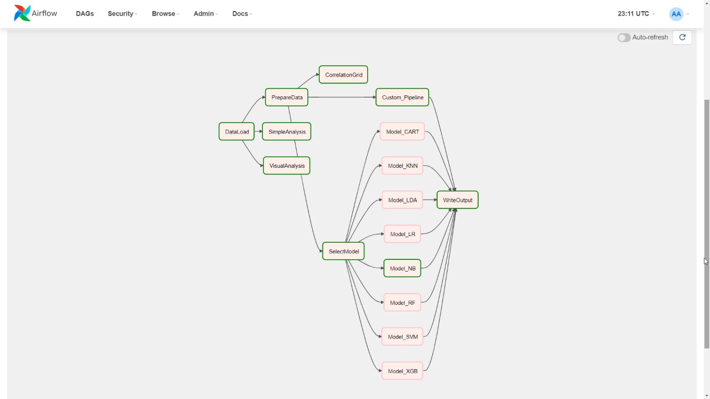
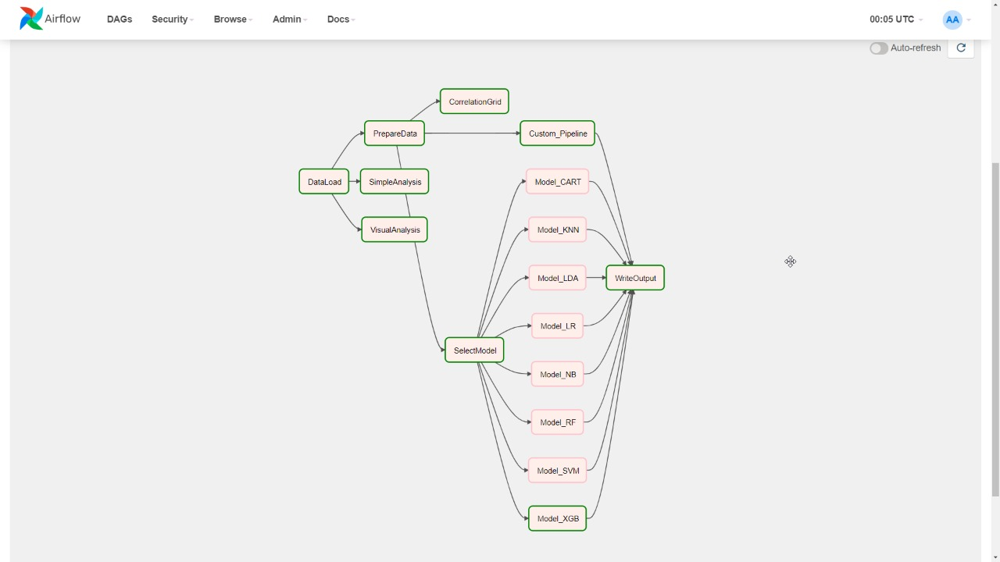

# Admission exam for Big Data Engineer position at Umba

## Instalación de lo necesario para un ambiente airflow

De acuerdo con la documentación de [Airflow con docker compose](https://airflow.apache.org/docs/apache-airflow/stable/start/docker.html) es necesario descargar el archivo `docker-compose.yaml` con el siguiente comando

```sh
curl -LfO 'https://airflow.apache.org/docs/apache-airflow/2.1.2/docker-compose.yaml'
```

Para utilizar S3 de manera local y sencilla, utilizaremos [Minio](https://min.io/) el cual ofrece una S3-Compatible API para uso de archivos locales

```yaml
# docker-compose.yaml
# ...
minio:
  image: minio/minio
  command: server /data --console-address ":9001"
  restart: always
  ports:
    - 9000:9000
    - 9001:9001
  volumes:
    - ./S3:/data
```

El siguiente paso es agregar las librerías que el python kernel ocupa y no están incluidas en la imagen de Apache Airflow las cuales son:

- seaborn
- plotly
- scikit-learn
- scipy
- xgboost

Para ello de acuerdo con la [documentación de extensibilidad de la imagen en un despliegue productivo](https://airflow.apache.org/docs/apache-airflow/1.10.13/production-deployment.html#extending-the-image) se siguieron los siguientes pasos:

1. Crear nuevo archivo llamado `Dockerfile` en la misma ruta que `docker-compose.yaml`

   ```dockerfile
   FROM apache/airflow:latest
   RUN pip install --no-cache-dir seaborn plotly scikit-learn scipy xgboost
   ```

2. Ejecutar comando `build` con tag personalizado:

   ```bash
   docker build . -t umba-airflow
   ```

   

3. Al archivo `env` agregar la siguiente línea:

   ```bash
   ...
   AIRFLOW_IMAGE_NAME=umba-airflow
   ```

4. Ejecutar el siguiente comando para recrear los contenedores.

   ```sh
   docker-compose up -d
   ```

   

Una vez recreados los contenedores con las dependencias correctas podemos proceder a agregar la conexión a Minio vía la interfaz o línea de comando:

#### CLI

```sh
airflow connections add 'custom_s3' --conn-uri 's3://:minioadmin@?aws_access_key_id=minioadmin&aws_secret_access_key=minioadmin&host=http%3A%2F%2Fminio%3A9000'
```

#### UI

Primero navegamos a `localhost:8080`
Y en la barra superior damos click en `Admin > Connections`

Después en el icono `+` para agregar conexión ingresamos los siguientes detalles:


## Implementación de DAG en AirFlow

### Construcción del DAG

El DAG se construyó haciendo uso del siguiente código,

```python
default_args = {
    "owner": "Mayra Patricia",
    "email": ["mayra.patricia@hotmail.com"],
}
```

El cual determina quien es el propietario de el DAG así como su correo electrónico para temas de reporting y seguimiento.

### Dependencias

```python
data = dataLoaders.DataLoad()
tasks.SimpleAnalysis(data)
graphs.VisualAnalysis(data)

# Data preparation depends on Data Loader
# And model selection depends on data preparation
cleanData = dataLoaders.PrepareData()
data >> cleanData >> modelSelection

# Correlation grid depends only on data preparation
tasks.CorrelationGrid(cleanData["dataKey"])
```

Se crea la tarea de <code> dataLoad </code> la cual genera como salida <code>data</code>.

Se crea la tarea de <code> prepareData </code> la cual genera como salida <code>cleanData</code>.

se construye la siguiente dependencia

<code>data </code> >> <code>cleanData</code> >> <code> modelSelection </code>

donde la construcción del <code> modelSelection </code> depende del éxito de las 2 tareas anteriores.

En paralelo se generan las tareas <code> SimpleAnalysis </code> y <code> VisualAnalysis </code> las cuales no devuelven algún valor debido a que no tienen dependencias aunque dependen de que <code> data </code> ya se haya generado lo que significa que se ejecutan después de <code> dataLoad </code>.

```python
# Create ML model tasks
modelDict = {}

# Add implemented models to dictionary
modelDict["NB"] = models.Model_NB()
modelDict["RF"] = models.Model_RF()
modelDict["XGB"] = models.Model_XGB()

```

Creación de tasks correspondientes a los modelos de Machine Learning que actualmente se tienen definidos.

```python
# Add models both real and dummy to dependency graph
finalNode = tasks.WriteOutput()
for modelName in ["LR", "LDA", "KNN", "CART", "NB", "RF", "SVM", "XGB"]:
    if modelName not in modelDict:
        modelDict[modelName] = PythonOperator(
            task_id="Model_" + modelName, python_callable=dummyModel
        )
    modelSelection >> modelDict[modelName] >> finalNode

# Custom model pipeline will be executed concurrent to model selection
cleanData >> models.Custom_Pipeline() >> finalNode
```

Se escoge el modelo a ejecutar dentro de los modelos disponibles. Se asignan las dependencias para la ejecución de <code>modelos</code> y <code>custom_pipeline</code>.

En el caso de modelos, primero será necesario escoger un modelo<code> modelSelection </code>, después ejecutar el modelo en cuestión <code>modelDict[modelName]</code> y como último paso el <code>finalnode</code> que consolida las salidas.

Para el caso de <code>customPipeline</code> , se tendrá que tener primero disponible <code> cleanData</code> el cual es la salida de <code> prepareData </code>.

```python
# Create branching to select best model
modelSelection = BranchPythonOperator(
    task_id="SelectModel", python_callable=tasks.branch
)
```

En el caso particular del <code>modelSelection</code> se crea esta tarea para poder definir el modelo a seleccionar y se mande a llamar la tarea llamada <code> branch </code> dentro del código del DAG.

Cada una de las tareas, como fueron pensadas y construidas se explica a detalle en la sección correspondiente a cada tarea.

### Data Load

Dentro de este Task, se incluye la carga del archivo original desde S3, como segundo paso se adiciona la columna de Age_cat misma que contiene una clasificación de edad indicada de la siguiente manera:

```markdown
| Rango de Edad | Clasificación |
| ------------- | ------------- |
| 18-25         | Student       |
| 25-35         | Young         |
| 35-60         | Adult         |
| 60-120        | Seniow        |
```

Esto debido a que determine que para todos los pasos posteriores se requerirá la implementación de esta columna.

Así mismo, una vez realizada esta información se carga esta información en el bucket de S3 correspondiente agregando al final del nombre **LDA** con la finalidad de indicar que se trata del CSV de salida del DataLoad.

Como paso adicional, se agrega dentro de la ruta en S3 la información de fecha y hora de la ejecución del DAG indicándolo como un folder previo al nombre del archivo como se muestra en el código a continuación.

```python
uploadKey = (
    kwargs["execution_date"].strftime("%Y-%m-%d-%H-%M-%S")
    + "/german_credit_data_LDA.csv"
)
```

Devuelve el uploadKey, que representa la ruta completa en la cual se subió el archivo **LDA**.

### Prepare Data

Este Task ejecuta la preparación del DataFrame <code> df_credit </code> y la creación de los sets de entrenamiento y prueba en <code>x </code> y <code> y </code> para las tareas relacionadas con Machine Learning, es dependiente de [Data Load](#data-load) ya que requiere de haber previamente creado la columna de Age_cat para este paso.

Como primer paso, se realiza la descarga de <code> german_credit_data_LDA.csv </code> desde S3 para la fecha y hora correspondiente a la ejecución actual (esta fecha se recupera del <code> \*\*kwargs </code> que se le pasa como argumento a la tarea), esto nos devolverá un archivo CSV dentro del equipo de computo responsable de la ejecución de esta tarea. mismo que leeremos desde la ruta local.

El código para la preparación del dataframe <code> df_credit </code> es el siguiente:

```python
    df_credit["Saving accounts"] = df_credit["Saving accounts"].fillna("no_inf")
    df_credit["Checking account"] = df_credit["Checking account"].fillna("no_inf")

    df_credit = df_credit.merge(
        pd.get_dummies(
            df_credit[
                [
                    "Purpose",
                    "Sex",
                    "Housing",
                    "Risk",
                    "Checking account",
                    "Saving accounts",
                    "Age_cat",
                ]
            ],
            prefix=["Purpose", "Sex", "Housing", "Risk", "Check", "Savings", "Age_cat"],
            drop_first=False,
        ),
        left_index=True,
        right_index=True,
    )

    del df_credit["Saving accounts"]
    del df_credit["Checking account"]
    del df_credit["Purpose"]
    del df_credit["Sex"]
    del df_credit["Housing"]
    del df_credit["Age_cat"]
    del df_credit["Risk"]
    del df_credit["Risk_good"]
```

El cual constituye una optimización a la forma en cómo se crean las columnas que se necesitan, para realizarlo todo en un solo paso, dentro de la sección de [**Descubrimientos interesantes**](#descubrimientos-interesantes) se menciona el porque en esta parte del código se mantienen todas las columnas generadas a diferencia del código original, en donde se eliminaban algunas de estas.

Posteriormente, se eliminan las columnas origen que dan cabida a la generación de estas nuevas columnas. ya que su información se encuentra contenida dentro de las columnas generadas, Adicionalmente, se elimina la columna de <code> Risk_good </code> tal como se especifica en el código original.

Este dataframe modificado se almacena en S3 como CSV con el nombre de <code> german_credit_data_PD.csv </code> precedido por el folder que contiene la fecha de ejecución del DAG.

Para la creación de las variables <code> x_train, y_train, x_test, y_test </code> se toman todas las columnas del dataframe para la parte de <code> x</code> exceptuando únicamente Risk_bad la cual representa la columna a considerar en <code> y </code>.

Se definen y asignan los grupos correspondientes y cada uno de ellos se guarda en S3. esto dentro de una carpeta adicional llamada <code> trainingData </code> ya que considero que estos conjuntos de entrenamiento son intermedios del proceso, y solo se consultarán en casos específicos, pero no representan parte inmediata de la salida final que se despliega en el folder principal del proyecto.

Devuelve, un arreglo de variables descritas a continuación.

- dataKey: Ruta completa de S3 en la cual se subió el archivo **PD**
- X_train: Ruta completa de S3 en la cual se subió el archivo **X_train**
- X_test: Ruta completa de S3 en la cual se subió el archivo **X_test**
- y_train: Ruta completa de S3 en la cual se subió el archivo **y_train**
- y_test: Ruta completa de S3 en la cual se subió el archivo **y_test**

### Correlation Grid

Este Task tiene como responsabilidad la gráfica del correlation Grid y tiene como dependencia [Prepare Data](#prepare-data) ya que después de este paso, se ha escrito el CSV que contiene al DataFrame con todas las columnas necesarias para la gráfica del correlation grid.

Esta tarea, descarga el CSV de la tarea anterior, prepara la gráfica a la cual se le llama <code> correlation_grid.png </code> y se publica en S3. siendo estos, los únicos pasos que realiza esta tarea.

Esta tarea no tiene ningún `return`, ya que como tal, tampoco existe alguna otra tarea que dependa de ella.

### Simple Analysis

Dentro del código del Kernel, antes de proceder con el análisis de algoritmos de Machine Learning , se realiza un análisis de la información a trabajar, tanto de las características del DataFrame así como gráficas para visualizar comportamientos de los datos y posibles patrones los cuales se encuentran en la tarea [Visual Analysis](#visual-analysis). Pensando en la productivización de un modelo de estas características, sería recomendable mantener este tipo de análisis permitiéndonos determinar cómo se mueve esta información en el tiempo, definir o analizar nuevas reglas para agregar dentro de los modelos entre otras posibilidades.

Es por ello que, Se decidió mantener estos cálculos dentro del grafo de AirFlow, de manera independiente a la línea de ejecución del modelo dadas 2 razones principales.

1.- El calculo del motor y de los análisis no son dependientes uno del otro por lo que si uno de ellos llegara a fallar no condiciona el éxito del otro, así mismo, estos pueden ejecutarse en paralelo ya que, en este momento ya se tienen definidos los algoritmos de Machine Learning a considerar.

2.- En caso de que se requiriera solo una de las 2 soluciones, en un momento determinado del tiempo sería sencilla su exclusión del DAG ya que se encuentran completamente independientes.

Hablando particularmente de esta tarea, se transformó toda la información de salida de este análisis para que pudiera escribirse en un archivo de texto plano para su posterior consulta al cual se le llamó <code> SimpleAnalysis.txt </code>, dentro del mismo se escriben todos los Análisis pertinentes así como una descripción sencilla de cada uno de ellos.

El flujo de esta tarea consiste en la lectura del DataFrame <code> df_credit </code> primeramente desde S3 para su posterior escritura a Local y consumirlo desde esta ubicación, luego haciendo uso de él se realiza los cálculos de análisis transformados a cadena de texto que se escriben primeramente de manera local para su posterior publicación en S3.

Esta tarea no tiene ningún `return`, ya que como tal, tampoco existe alguna otra tarea que dependa de ella.

### Visual Analysis

Esta tarea representa la parte gráfica del análisis realizado sobre los datos, previo a el cálculo de los modelos de Machine Learning, una descripción de esta parte de análisis y su consideración dentro del DAG de AirFlow más específica la podremos encontrar en el contenido de la tarea [Simple Analysis](#simple-analysis).

Hablando específicamente de esta tarea, se tienen 2 tipos de graficaciones identificadas, aquellas basadas en Plotly (Gráficas Dinámicas) y en matplotlib (Gráficas Estáticas). las cuales se agregaron al archivo de graficación en formato HTML.

Para la construcción de los archivos se utilizó la siguiente lógica:

```python
graphs = []
```

Se define una lista de figuras que contendrá las gráficas a presentar en el HTML originalmente vacío y las figuras que se vayan creando se agregan a esta lista como se muestra a continuación.

```python
graphs.append(Nombre_Figura)
```

donde <code> Graphs </code> es el nombre del arreglo, append aplica la operación de concatenación y se indica el nombre creado para la figura en cuestión.

Una vez que se han agregado todas las figuras que se desea graficar se hace uso del siguiente código:

```python
with open("VisualAnalysis.html", "w") as f:
    for graph in graphs:
        if isinstance(graph, go.Figure):
            f.write(graph.to_html(full_html=False, include_plotlyjs="cdn"))
        elif isinstance(graph, plt.Figure):
            g = BytesIO()
            graph.savefig(g, format="png")
            encoded = base64.b64encode(g.getvalue()).decode("utf-8")
            html_string = """""".format(encoded)
            f.write(html_string)
        else:
            print("Invalid Graph Type Found: " + str(type(graph)))
```

Se abre el archivo HTML en modo escritura, y para cada una de las gráficas de se encuentran en el arreglo de <code> graph </code> se valida el tipo de gráfico que es.

En caso de ser uno de tipo <code> go.figure </code> (Gráfica Dinámica) entonces se escribe el <code> graph </code> a HTML con la etiqueta <code> to_html </code> en False para que simplemente se cree un div dentro del cuerpo del HTML y no el HTML completo (Esto nos permitirá agregar mas gráficas).

Para el caso donde se trata de una figura de tipo <code> plt.Figure </code>(Gráfica Estática) se escribirá para cada una una imagen <code> .png </code> y se agrega al cuerpo del HTML como un source de imagen. Este tipo de gráfico no tiene movimiento por lo que el hecho de ser exportada como una imagen no afectará su funcionalidad.

Se tiene un tercer caso donde no es alguna de las 2, y en este caso se trataría entonces de un tipo de gráfico aún no soportado por este DAG. por lo que estaría desplegando el error.

Se pueden agregar casos y definir su funcionalidad dentro de este mismo cuerpo de escritura de forma dinámica en caso de que el negocio así lo requiriera en un determinado momento. ya que está preparado, y si no soportará el agregado de algún tipo de Gráfico en particular notificará con el error existiendo la posibilidad de adicionar su funcionalidad.

Una vez escrito el archivo <code> VisualAnalysis.html</code> de manera local en donde se ejecuta el análisis se procede a su carga directamente a S3.

El task en cuestión no tiene definido algún return ya que no existe ningún task posterior a él.

### Select Model

Para seleccionar el modelo se lleva a cabo la carga de los archivos de entrenamiento de <code> x_train y y_train </code> desde S3 recuperando su ruta desde <code>XCom </code> de aquellos que fueron publicados por [Prepare Data](#prepare-data).

Posterior a ello se hace la evaluación de los modelos misma que se escribe en modo de mensaje dentro de los logs de AirFlow para conocer la evaluación individual asignada a cada uno de ellos.


Se graficará así mismo la comparación de algoritmos dentro del archivo <code> "algorithm_comparison.png" </code> usando el plot indicado en el Kernel de python proporcionado para esta tarea. escribiendo tanto de manera local como en S3.

Además, como parte de la implementación en AirFlow la propuesta aquí es ejecutar únicamente el modelo que genere el mejor score dado por el preanálisis generado en este nodo. Para ello se generó el código que se presenta a continuación.

```python
results = {} #important
names = [] #important
scoring = "recall"
for name, model in models:
    kfold = KFold(n_splits=10)
    cv_results = cross_val_score(model, X_train, y_train, cv=kfold, scoring=scoring) #important
    results[name] = cv_results #important
    names.append(name) #important
    msg = "%s: %f (%f)" % (name, cv_results.mean(), cv_results.std())
    print(msg)
```

Marcado como **important** podremos encontrar aquellas líneas que estaré explicando, primeramente se crea un diccionario llamado <code> results </code> el cual contendrá en detalle de los resultados de los modelos ejecutados así como su <code> name </code> esto para cada uno de los modelos que se ejecuten.

Al final se construye un diccionario que contendrá el detalle del nombre de los algoritmos de Machine learning evaluados así como su score.

```python
## Remove models which are not implemented
best = {"name": "", "score": 0}
notImplemented = ["LR", "LDA", "KNN", "CART", "SVM"]
list(map(results.pop, notImplemented))
for name, result in results.items():
    currentScore = result.mean() - result.std()
    if currentScore > best["score"]:
        best["score"] = currentScore
        best["name"] = name
```

Se retiran del diccionario aquellos que no se encuentren implementados aún dentro del DAG haciendo uso de la lista <code> notImplemented </code>.

Se recorren los algoritmos restantes, buscando su nombre y su resultado. para cada uno de los resultados se calcula su promedio y su desviación estándar.

El mejor algoritmo será aquel cuyo resultado genere el promedio más alto y la desviación estándar más baja por lo que, se implementó la resta de ambas cifras como <code> currentScore </code> .

El proceso se queda con aquel algoritmo que genere el <code> currentScore </code> más alto.

Este task devolverá una cadena compuesta de la siguiente forma <code> "Model\_" + best["name"] </code> indicando el nombre del modelo que posee el mejor score.

### Model NB / Model RF / Model XGB

Cada uno de los modelos implementados siguen de manera general la misma secuencia. por lo que el contenido que se menciona en esta sección será muy similar al mencionado en [Custom PipeLine](#custom-pipeline)

Se obtiene la ruta en la que [Prepare Data](#prepare-data) escribió los sets de entrenamiento para <code> x_train, x_test, y_train, y_test</code> haciendo uso de <code>XCom</code> se descarga desde esta ruta los archivos de entrenamiento de S3 y se cargan como arrays de numpy buscando tener toda la información necesaria para llevar a cabo la ejecución del pipeline el cual representa el siguiente paso.

El modelo de GaussianNB contenía la implementación de su ROC curve para ver su comportamiento de predicción gráfica que encontré muy útil para la apreciación de los resultados del modelo por lo que, agregue esta funcionalidad para todos los modelos que se calculan. por lo que, dentro de cada uno de los códigos se calcula su ROC curve, originalmente me plantee la idea de graficar el ROC en el [Write Output](#write output), sin embargo, requiere de las siguientes curvas <code> fpr, tpr, thresholds </code> las cuales crecen dependiendo de la entrada de datos por lo que no son candidatas para ser enviadas por <code> XCom </code> y únicamente para la graficación no encontré mucho valor en escribirlas en S3, es por ello que dentro de cada uno de los Tasks de las tareas se realiza la graficación.

Misma que se publica de manera local y en S3 así mismo también se publica la <code> y_pred </code> generada por el modelo como un archivo <code> .npy </code> para que no pierda sus propiedades de arreglo de tipo Numpy.

Se encontraron criterios de evaluación de sus resultados que se comparten entre todos los modelos los cuales son:

- Accuracy Score
- Confusion Matriz
- Beta Score
- Classification Report
- Recall Score

Para su cálculo únicamente requieren <code> y_test y y_pred</code> información que se disponibilizará al Task [Write Output](#write output) para que este pueda calcularlos únicamente para el modelo con el mejor Score.

Además de estos criterios se encontró que cada modelo en particular calcula otros como son:

- Model Score
- grid*search.best_score*
- grid*search.best_params*

Por lo que, estos parámetros en particular se calculan dentro de cada uno de los modelos y se devuelven como un parámetro del `return`.

Dependiente del modelo se calculan diferentes criterios particulares como se indica a continuación.

Random Forest:

- grid*search.best_score*
- grid*search.best_params*

XGB:

- grid*search.best_score*
- grid*search.best_params*

GaussianNB:

- Model Score

El parámetro de retorno sin importar el modelo respeta la siguiente forma:

- y_pred: Ruta completa de S3 en la cual se subió el archivo de y predecido **y_pred**
- roc_curve: Ruta completa de S3 en la cual se subió el gráfico **roc_curve**
- details: Detalle en texto plano del calculo de los criterios particulares dependiendo el modelo

### Dummy Model

Debido a que no todos los módulos están implementados, se llevo a cabo la implementación del Dummy Model el cual contiene un return Dummy para ser llamado por aquellos modelos pendientes de codificar en caso de querer integrarlos todos en el [Select Model](#select-model). el código de este Task se muestra a continuación.

```python
# Create Dummy Model task for all other models
def dummyModel(**kwargs):
    print("Sample Model: Does nothing")
    return {
        "y_pred": "Path-Dummy",
        "roc_curve": "Path-Dummy",
        "details": "Nothing"
    }
```

### Custom PipeLine

Dentro del código del Kernel compartido, se detecto que además de los códigos correspondientes a un modelo de Machine Learning se crea un modelo customizado que se basa principalmente en GaussianNB pero que se robustece agregando evaluación con PCA Y Kbest.

Este modelo, tiene una evaluación promedio consistentemente mas alta que la evaluación inicial de los modelos, por lo que si se agregará como parte del [Select Model](#select-model) este ganaría consistentemente generando un mejor score que los otros, es por ello tome la decisión de que este se manejará de forma independiente, se calculará y se evaluará junto con el mejor modelo gestionado por el [Select Model](#select-model). Para que posteriormente Write Output se encargará de gestionar la salida únicamente para el modelo con el mejor score entre estos 2.

Los pasos que se siguen dentro de Custom Pipeline son los siguientes:

Se obtiene la ruta en la que [Prepare Data](#prepare-data) escribió los sets de entrenamiento para <code> x_train, x_test, y_train, y_test</code> haciendo uso de <code>XCom</code> se descarga desde esta ruta los archivos de entrenamiento de S3 y se cargan como arrays de numpy buscando tener toda la información necesaria para llevar a cabo la ejecución del pipeline el cual representa el siguiente paso.

El modelo de GaussianNB contenía la implementación de su ROC curve para ver su comportamiento de predicción gráfica que encontré muy útil para la apreciación de los resultados del modelo por lo que, agregue esta funcionalidad para todos los modelos que se calculan. en este caso se lleva a cabo el calculo de su ROC curve, originalmente me plantee la idea de graficar el ROC en el [Write Output](#write output), sin embargo, requiere de las siguientes curvas <code> fpr, tpr, thresholds </code> las cuales crecen dependiendo de la entrada de datos por lo que no son candidatas para ser enviadas por <code> XCom </code> y únicamente para la graficación no encontré mucho valor en escribirlas en S3, es por ello que dentro de este Task se realiza esta graficación.

La graficación planteada se publica de manera local y en S3, también se publica la <code> y_pred </code> generada por este modelo como un archivo <code> .npy </code> para que no pierda sus propiedades de arreglo de tipo Numpy.

Para cada modelo, se encontraron criterios de evaluación de sus resultados que se comparten entre todos los modelos los cuales son:

- Accuracy Score
- Confusion Matriz
- Beta Score
- Classification Report
- Recall Score

Los cuales para su calculo únicamente requieren <code> y_test y y_pred</code> información que se disponibilizará al Task [Write Output](#write output) para que este pueda calcularlos únicamente para el modelo con el mejor Score.

Además de estos criterios se encontró que cada modelo en particular calcula otros como son:

- Model Score
- grid*search.best_score*
- grid*search.best_params*

Por lo que, estos parámetros en particular se calculan dentro de cada uno de los modelos y se devuelven como un parámetro del return

Este modelo en particular calcula su <code>model.score</code> , por lo que, su return esta constituido como se muestra a continuación.

- y_pred: Ruta completa de S3 en la cual se subió el archivo de y predecido **y_pred**
- roc_curve: Ruta completa de S3 en la cual se subió el gráfico **roc_curve**
- details: Detalle en texto plano del calculo del **Model Score **

### Write Output

Este Task representa la tarea final del Grafo de AirFlow por lo que en el se escoge el mejor modelo entre el seleccionado por [Select Model](#select-model) y ejecutado respectivamente asi como el [Custom PipeLine](#custom-pipeline).

Para el modelo seleccionado almacena en S3 su:

- ROC curve (Grafica del modelo)
- FinalOutput.csv (Archivo que contiene las columnas originales así como la columna predicha por el modelo seleccionado de la tabla de df_credit no es el original sino el x_test generado en [Prepare Data](#prepare-data))
- FinalOutput.txt (Información en texto plano acerca del performance del modelo)

Analicemos como lo genera:

```python
ti = kwargs["ti"]
y_test_key = ti.xcom_pull(task_ids="PrepareData", key="y_test")
cleanDataKey = ti.xcom_pull(task_ids="PrepareData", key="dataKey")
pipelineResult = ti.xcom_pull(task_ids="Custom_Pipeline")
selectedModel = ti.xcom_pull(task_ids="SelectModel")
modelResults = ti.xcom_pull(task_ids=selectedModel)
X_test_key = ti.xcom_pull(task_ids="PrepareData", key="X_test")
```

como primer paso, es indispensable la extracción de los parámetros desde <code>XCom </code> de diferentes Tasks del modelo que para este punto ya habrán sido ejecutadas de acuerdo con las dependencias. Analicemos cada 1:

- [Prepare Data](#prepare-data) y-test : necesario para el calculo de accurracy_score, confusion_matrix, beta_score ,classification_report , recall_score como variable de referencia de los valores correctos en la columna a predecir para las validaciones
- [Prepare Data](#prepare-data) dataKey: Ruta completa del archivo de **PD** para conocer las columnas de este archivo e informarlas en el archivo resultado de esta función como las columnas del DataFrame predicho
- [Custom PipeLine](#custom-pipeline) resultado completo: para conocer la ruta donde se encuentra su y_pred, roc_curve y sus details
- [Select Model](#select-model) Modelo seleccionado: para conocer cual fue el modelo con el mejor resultado dentro del select model para preguntar por su resultado en cuestión
- [Model NB ,Model RF, Model XGB](#model-nb--model-rf--model-xgb) resultado completo: para conocer la ruta donde se encuentra su y_pred, roc_curve y sus details
- [Prepare Data](#prepare-data) x_text: para conocer el dataframe de prueba contra el que se generaron las salidas de <code>y</code> tanto para el Pipeline como para el selected model.

Se descargan los archivos para los que se recupero su path desde <code> XCom </code> por S3.

Se calcula el beta_score tanto para el modelo seleccionado como para el pipe line y se selecciona el mejor con el siguiente código.

```python
modelScore = fbeta_score(y_test, y_pred_model, beta=1)
pipelineScore = fbeta_score(y_test, y_pred_pipeline, beta=1)

# Get Y_pred from best model
best_y_pred = y_pred_pipeline if pipelineScore > modelScore else y_pred_model
```

Una vez conociendo el mejor modelo, se elimina la ROC curve escrita en S3 para el peor modelo. Esto para mantener únicamente el detalle del mejor calculado haciendo uso de la función <code> delete_object </code> de S3 ya que se conoce el path en el que se escribió recuperado desde <code> XCom </code>.

Se genera el <code> FinalOutput.csv </code> el cual será un dataframe que contendrá los encabezados de **PD** el contenido de las columnas de **x_text** y la columna predicha de **y_pred** . mismo que se escribe tanto a local como a S3.

Como ultimo paso se genera el <code> FinalOutput.txt </code> con los calculos de accurracy_score, confusion_matrix, beta_score ,classification_report , recall_score para el modelo con el mejor score, información calculada a partir de **y_test** y **x_test**.

Este Task no tiene return ya que se trata de la última tarea del DAG.

## Pruebas

Como parte del proceso de pruebas para el DAG propuesto en AirFlow se ejecuto, para cada uno de los posibles caminos para los modelos que se tienen implementados, para todos ellos se genera un folder con la fecha de ejecución el cual en la raíz contiene los siguientes archivos.

- Correlation Grid
- german_credit_data_LDA.csv
- german_credit_data_PD.csv
- roc_curve_pipeline.png
- simpleAnalysis.txt
- VisualAlalysis.html

También incluye una carpeta llamada <code> trainingData </code> la cual contiene la siguiente información especifica respecto al entrenamiento:

- x_train.npy
- x_test.npy
- y_pred_pipeline.npy
- y_test.npy
- y_train.npy

Lo anteriormente descrito se puede visualizar en la siguiente imagen:


Cuando lee


### GaussianNB

El DAG exitoso generado por AirFlow se muestra en la siguiente imagen



De esta manera podemos conocer los nodos que se ejecutan así como el éxito de estos. La salida del modulo de **NB** se muestra a continuación


En esta imagen se puede visualizar lo que regresa el modulo de <code> model_nb</code> con su respectiva evaluación del modelo.


dentro del [Write Output](#write-output) se determina el mejor modelo por lo que calcula ambos Betas para poder escoger el mejor de ellos y configurar su salida basado en esta información. Como se puede notar regresa 0 indicando que el nodo termino con éxito, así como también la escritura de los archivos correspondientes.

### Random Forest

El DAG exitoso generado por AirFlow se muestra en la siguiente imagen


De esta manera podemos conocer los nodos que se ejecutan así como el éxito de estos. La salida del modulo de **RF** se muestra a continuación


Desde donde se puede apreciar que el nodo final retorna un 0 de éxito así como su return correspondiente con sus rutas tanto para su predicción como para su ROC así como los cálculos de detalle correspondientes a este modelo.

### XGB

El DAG exitoso generado por AirFlow se muestra en la siguiente imagen



La imagen anterior nos permite conocer los nodos que se ejecutan así como el éxito que se obtuvo para estos. La salida del modulo de **XGB** se muestra a continuación


Desde donde se puede apreciar que el nodo final retorna un 0 de éxito así como su return correspondiente con sus rutas tanto para su predicción como para su ROC así como los cálculos de detalle correspondientes a este modelo.

## Descubrimientos interesantes

Se tiene la siguiente función dentro del código de Leonardo Ferreira, sin embargo, este código no se manda a llamar en ninguna parte de la ejecución por lo que esta función esta de más.

```python
def one_hot_encoder(df, nan_as_category = False):
    original_columns = list(df.columns)
    categorical_columns = [col for col in df.columns if df[col].dtype == 'object']
    df = pd.get_dummies(df, columns= categorical_columns, dummy_na= nan_as_category, drop_first=True)
    new_columns = [c for c in df.columns if c not in original_columns]
    return df, new_columns
```

En las líneas de código que se encuentran a continuación se puede observar que se están creando múltiples columnas una por cada valor diferente que existe en la columna que se evalúa, por ejemplo, para el caso de Sex se tienen 2 columnas nuevas que son:

- Male
- Female

Sin embargo, se hace uso de la función <code> drop_first=True </code> en la mayoría de ellos excepto en Risk, lo que nos llevaría a que volviendo al caso de el ejemplo, en la columna Sex.

Se eliminará el primero osea <code> Male </code> y se quedará únicamente con la columna de <code> Female </code> esto en un principio no tendría mucho sentido ya que conviene analizar los creditos tanto de hombres como de mujeres.

Es por ello que tome la decisión de quitar esta condición para todas las columnas.

```python
#Purpose to Dummies Variable
df_credit = df_credit.merge(pd.get_dummies(df_credit.Purpose, drop_first=True, prefix='Purpose'), left_index=True, right_index=True)
#Sex feature in dummies
df_credit = df_credit.merge(pd.get_dummies(df_credit.Sex, drop_first=True, prefix='Sex'), left_index=True, right_index=True)
# Housing get dummies
df_credit = df_credit.merge(pd.get_dummies(df_credit.Housing, drop_first=True, prefix='Housing'), left_index=True, right_index=True)
# Housing get Saving Accounts
df_credit = df_credit.merge(pd.get_dummies(df_credit["Saving accounts"], drop_first=True, prefix='Savings'), left_index=True, right_index=True)
# Housing get Risk
df_credit = df_credit.merge(pd.get_dummies(df_credit.Risk, prefix='Risk'), left_index=True, right_index=True)
# Housing get Checking Account
df_credit = df_credit.merge(pd.get_dummies(df_credit["Checking account"], drop_first=True, prefix='Check'), left_index=True, right_index=True)
# Housing get Age categorical
df_credit = df_credit.merge(pd.get_dummies(df_credit["Age_cat"], drop_first=True, prefix='Age_cat'), left_index=True, right_index=True)
```
